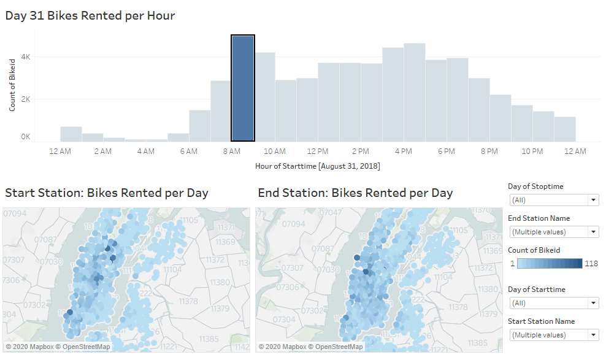

# CitiBike Data Analysis

## About the Project
### Some questions to answer
  * Is NYC the city that never sleeps? 
  * How many bikes were used at each station?
  * What's the hourly rental count per station on a selected day?
  * Which bike has been used the most?
  
### Data, Tools Used & Clean-up
Data: Selected August 2018 NYC Stations from [Citi Bike Data](https://www.citibikenyc.com/system-data)
Tableau: Removed stations that didn't have a name. Made conversions to tripduration.

## Findings
Click here for Tableau Story: [Snapshot of CitiBike Use in August 2018](https://public.tableau.com/profile/tamyam#!/vizhome/SnapshotofCitiBikeUseinAugust2018/Story1?publish=yes)

### Number of Bikes Rented At Each Station

Pershing Square North in Midtown Manhattan has the most bikes rentals at 16,400rentals for this month. Some interesting locations near this bike station are the Grand Central Terminal, Bryant Park, Koreatown and Little Brazil. This could contribute to its high rental count but there are a plethora of bike stations in Manhattan so more research on the area will be needed to find the core reason why.

### Average Trip Logged at Each Station

Sullivan Pl & Bedford Ave in Brooklyn had the most logged trip in August at 459 minutes(7hrs). A possbile reason could be that it's right near Prospect Zoo which means more people are around the area and thus more people would be likely to take a bike ride.

### Selected Daily Comparison

Here I selected three days out of the month and filtered the data to display bikes rented per hour. The height of bike use for all the three days selected coincide with morning and even rush hour. The rentals are pretty much continuous except from around 2AM to 5AM which match up to when nightlife ends in the city. 

As you can see, Day 15 had the most frequent bike use overall with the peak use at 7PM. I assumed that maybe there was a special day going on but didn't find anything significant. The weather was favorable for all three days ranging from mid 70s to hihg 80s. The assumption I could make with the current information available is that both August 1st and August 15th landed on a Wednesday while August 31st landed on a Friday. This could possibly explain why there's less activity on the 31st compared to the two other days since it's the end of the work week. 

### Detailed Selected Daily Comparison 
These maps are interactive in Tableau Story by picking the hour in the bar graph to see the dispersment of the bikes rented throughout the city map. The pictures below display the top hour of bike rentals on the first, middle, and last days of the month for comparison.

August 1st: The daily rental peak is at 5PM. The Start Station map shows the most bikes rentaled occur around Times Square, Midtown South and Tribeca regions while the End Station map has a more even dispersment.

August 15: The daily rental peak is at 6PM. The Start Station map shows the most bikes rentaled are more concentrated in Madison Square/Flatiron areas while the End Station map shows a more even spread around Gramercy and East Village regions along with three specific stations in Clinton/Chelsea regions.

August 31: The peak rental hour is at 8AM. The Start Station map shows the most bikes rented around Lincoln Square and Stuyvesant Town areas while the End Station map shows a concentration around Times Square and Central Park regions.

### Most Used Bike

Two bikes were close as used the most during this month which are Bike Id:18389 and Bike Id:29784 with 1,074 and 1,070 days respectfully. This converts to almost 3 years worth of use. Considering intense use of these two bikes, it might be beneficial to get a maintanence check or replacement depending on they're condition. While on the opposite end, there were a significant amount of bikes that had the least amount of use at 2 days. One of the factors behind this could be that they're new or that they aren't in rotation in the most used stations in Manhattan.

## Resources
* NYC Map: https://www.mapquest.com/us/new-york/new-york-ny-282040974
* NYC August 2018 Weather: https://www.timeanddate.com/weather/usa/new-york/historic?month=8&year=2018
* CitiBike Picture: https://nypost.com/2014/05/07/citi-bike-rack-remains-a-death-trap-in-the-west-village/
